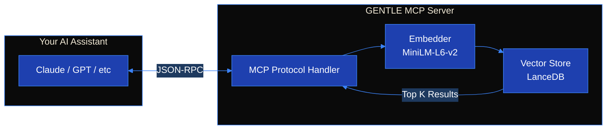
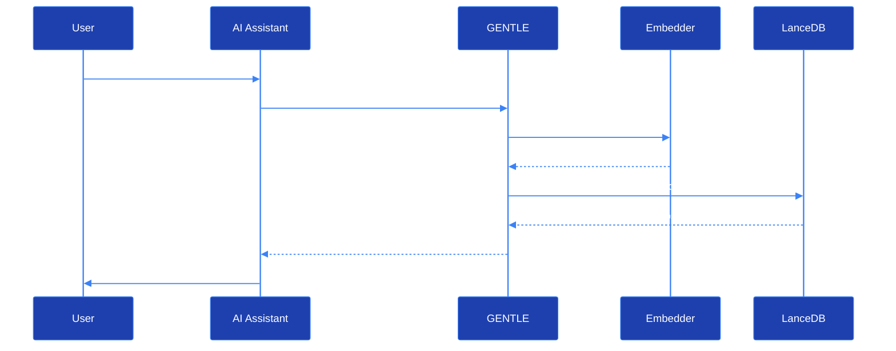
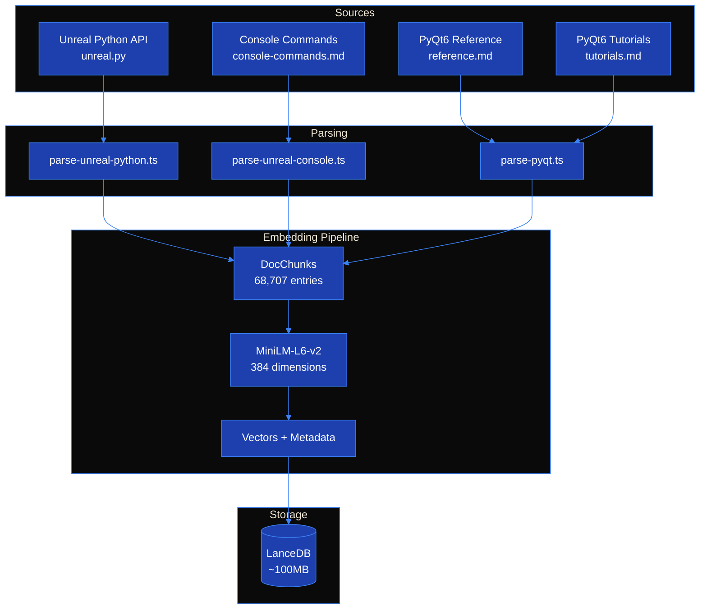

[](https://www.npmjs.com/package/gentle-mcp)
[](https://www.npmjs.com/package/gentle-mcp)
[](https://opensource.org/licenses/MIT)
[](https://nodejs.org/)

# GENTLE MCP

**G**ame **E**ngine **N**avigation **T**ool for **L**earning & **E**xploration

*Dedicated to GameMaker[GentleOnes]*

An MCP server providing instant semantic search across game development documentation. No more copy-pasting docs into your LLM - GENTLE gives your AI assistant direct access to Unreal Engine and PyQt6 documentation.

## Overview



## Features

- **Semantic Search** - Find relevant docs using natural language, not keyword matching
- **Fully Local** - No API keys, no internet required at runtime
- **Fast** - Sub-second queries against 68k+ documentation entries
- **Multi-Source** - Unreal Python API, Console Commands, PyQt6 Reference & Tutorials

## Documentation Sources

| Source | Entries | Description |
|--------|--------:|-------------|
| `unreal-python` | 60,563 | Classes, methods, properties, enums from UE5 Python API |
| `unreal-console` | 8,055 | Console commands (`stat`, `r.`, `t.`) and variables |
| `pyqt-reference` | 36 | Official PyQt6 reference (signals, slots, properties) |
| `pyqt-tutorials` | 53 | Practical PyQt6 tutorials with code examples |
| **Total** | **68,707** | |

## Tools

| Tool | Description |
|------|-------------|
| `search_unreal_python` | Search Unreal Engine Python API documentation |
| `search_unreal_console` | Search console commands and variables |
| `search_pyqt_reference` | Search PyQt6 official reference docs |
| `search_pyqt_tutorials` | Search PyQt6 practical tutorials |
| `search_all` | Search across all documentation sources |
| `list_sources` | List available sources with entry counts |

## Installation

No build steps required - embeddings are pre-built and included in the package.

### Claude Desktop

Add to your config file:
- **Linux**: `~/.config/Claude/claude_desktop_config.json`
- **macOS**: `~/Library/Application Support/Claude/claude_desktop_config.json`
- **Windows**: `%APPDATA%\Claude\claude_desktop_config.json`

```json
{
  "mcpServers": {
    "gentle": {
      "command": "npx",
      "args": ["gentle-mcp"]
    }
  }
}
```

### Cursor

Add to `.cursor/mcp.json` in your project root (or global settings):

```json
{
  "mcpServers": {
    "gentle": {
      "command": "npx",
      "args": ["gentle-mcp"]
    }
  }
}
```

### Cline (VS Code Extension)

Open VS Code Settings → Cline → MCP Servers, then add:

```json
{
  "gentle": {
    "command": "npx",
    "args": ["gentle-mcp"]
  }
}
```

### Windsurf

Add to `~/.windsurf/mcp_config.json`:

```json
{
  "mcpServers": {
    "gentle": {
      "command": "npx",
      "args": ["gentle-mcp"]
    }
  }
}
```

### Claude Code (CLI)

Add to `~/.claude/settings.json`:

```json
{
  "mcpServers": {
    "gentle": {
      "command": "npx",
      "args": ["gentle-mcp"]
    }
  }
}
```

### Global Installation (Optional)

If you prefer a global install instead of `npx`:

```bash
npm install -g gentle-mcp
```

Then use `"command": "gentle-mcp"` with no args in your config.

## Requirements

- Node.js 24+
- ~150MB disk space (embeddings + vector database)

## Usage Examples

Once configured, ask your AI assistant questions like:

| Query | Best Tool |
|-------|-----------|
| "How do I spawn an actor at a location?" | `search_unreal_python` |
| "What console command shows FPS?" | `search_unreal_console` |
| "Create a button with click handler" | `search_pyqt_tutorials` |
| "What signals does QLineEdit emit?" | `search_pyqt_reference` |

## Architecture

### Search Flow



### Data Pipeline



### Chunk Structure

Each documentation entry is stored as a chunk:

```typescript
interface DocChunk {
  id: string;           // "unreal-python:class:Actor"
  source: DocSource;    // "unreal-python" | "unreal-console" | ...
  type: DocType;        // "class" | "method" | "property" | ...
  name: string;         // "Actor"
  parentName?: string;  // "EditorUtilityLibrary"
  content: string;      // Full documentation text
  version?: string;     // "5.4"
  embedding: number[];  // 384-dim vector
}
```

## Development

### Setup

```bash
git clone https://github.com/ul0gic/gentle-mcp
cd gentle-mcp
npm install
```

### Scripts

| Script | Description |
|--------|-------------|
| `npm run dev` | Run development server with hot reload |
| `npm run build` | Compile TypeScript to dist/ |
| `npm run fetch` | Download source documentation |
| `npm run parse` | Parse sources into chunks |
| `npm run embed` | Generate embeddings and populate LanceDB |
| `npm run setup` | Run fetch + parse + embed |
| `npm run check` | Run typecheck and linting |

### Project Structure

```
gentle-mcp/
├── src/
│   ├── index.ts          # MCP server entry point
│   ├── embedder.ts       # MiniLM embedding wrapper
│   ├── db/
│   │   └── vector-store.ts   # LanceDB interface
│   ├── tools/
│   │   └── search.ts     # Search tool implementations
│   └── types/
│       └── index.ts      # TypeScript type definitions
├── scripts/
│   ├── fetch-sources.ts  # Download documentation
│   ├── parse-all.ts      # Parse all sources
│   ├── embed-all.ts      # Generate embeddings
│   └── parsers/          # Source-specific parsers
├── sources/              # Raw documentation files
├── data/
│   ├── chunks/           # Parsed JSON chunks
│   └── lancedb/          # Vector database
└── dist/                 # Compiled output
```

## License

MIT
